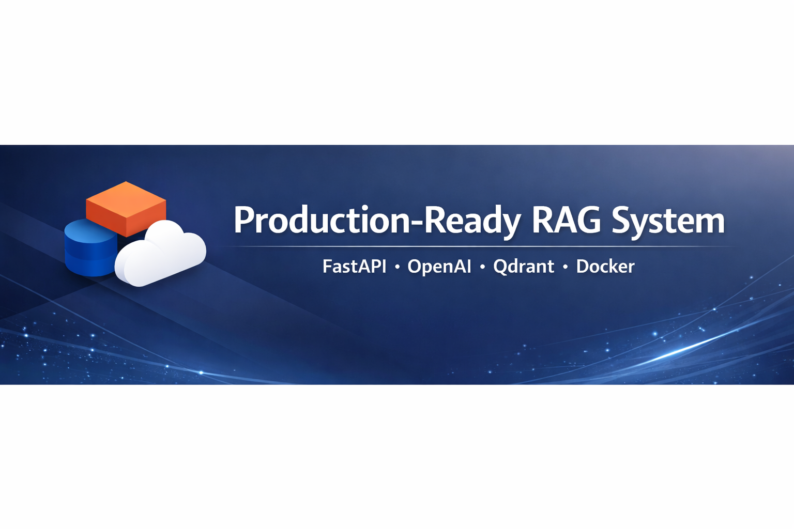

<p align="center">
  
</p>

# Production RAG System

A Retrieval-Augmented Generation (RAG) project built with Python, OpenAI, and Qdrant.

The goal of this project is to design a modular, continuously evolving system capable of processing documents, building a vector index, and generating answers based on context retrieved from a vector database.

This repository serves as a foundation for further development toward a production-ready system and evolves alongside ongoing learning and architectural experimentation.

---

## Project Objectives

The main goals of the project are:

- Implementing a complete RAG pipeline from scratch  
- Gaining a deep understanding of embedding-based systems and vector search architectures  
- Building a modular structure that supports future extensions  
- Gradually transitioning from an experimental setup to production-oriented code  

This is not a one-off exercise. The project is developed iteratively, with a strong focus on code quality, structure, testability, and scalability.

---

## Current Capabilities

### 1. PDF Ingestion

- Loading PDF documents  
- Splitting content into chunks using `SentenceSplitter`  
- Generating embeddings via OpenAI  
- Storing vectors along with metadata in Qdrant  

### 2. Retrieval

- Generating embeddings for user queries  
- Performing semantic search in Qdrant (COSINE similarity)  
- Constructing contextual input from retrieved results  
- Generating answers using an LLM based on the provided context  

### 3. Modular Architecture

## Project Structure

src/
  rag/
    loaders/
    services/
    storage/
    schemas.py
    main.py
tests/
scripts/

- `src/rag` – main application package  
- `tests` – unit tests  
- `scripts` – experimental and utility scripts  
- `data` – local data (ignored in the repository)  

The project is divided into logical layers:

- `loaders` – responsible for data ingestion and preprocessing  
- `services` – application logic (ingestion, retrieval, LLM interaction)  
- `storage` – vector database integration  
- `schemas` – data models (Pydantic)  

This structure enables safe extension and future scalability.

---

## Logical Architecture

### Ingestion Pipeline
PDF → Chunking → Embedding (OpenAI) → Upsert to Qdrant

### Retrieval Pipeline
User Query → Embedding → Vector Search (Qdrant) → Context Construction → LLM Response Generation

## Configuration

The project uses environment variables:

```bash
OPENAI_API_KEY=
QDRANT_ENDP=
QDRANT_API_KEY=
```

Secrets are not stored in the repository.  
A `.env.example` file contains the required variables.

---

## Getting Started

1. Clone the repository:

git clone <repository-url>
cd <repository-name>

2. Install dependencies (using uv):
uv sync

3. Set environment variables in `.env`.

4. Run the application:
uv run python -m rag.main

(Adjust the command depending on whether you run it as a CLI app or via FastAPI.)

---

## Development Roadmap

The project is evolving toward a production-grade architecture.

Planned extensions include:

- Adding conversational memory  
- Integrating FastAPI as an API layer  
- Retrieving and processing data from:
  - Web sources  
  - Text-based messaging platforms  
  - Additional external systems  
- Cloud integration (e.g., AWS)  
- Asynchronous ingestion and retrieval pipelines  
- Expanded unit and integration testing  
- Implementation of production best practices (logging, environment configuration, CI/CD)

---

## Long-Term Vision

The long-term objective is to build a complete, scalable RAG system suitable for deployment in a production environment.

This project reflects an ongoing journey into AI system architecture, backend engineering, and production-oriented development practices.

